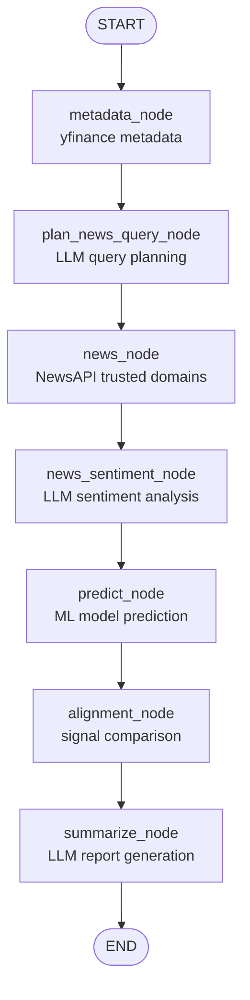
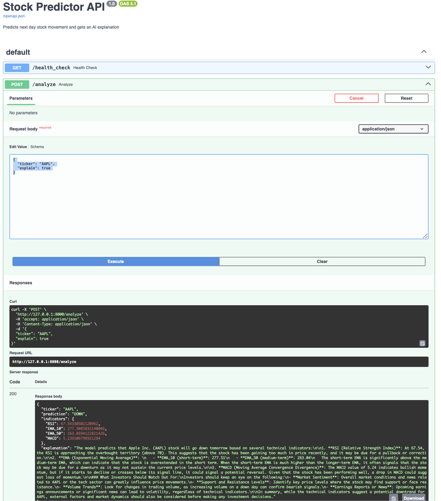

# Agentic Stock Analysis System (ML + LLM Orchestration via LangGraph)

## Overview
This project implements an end-to-end stock analysis system built around an agentic AI architecture using LangGraph.

The system uses a graph-based agent to orchestrate deterministic ML models and LLM-powered reasoning across multiple steps, including market data ingestion, feature engineering, news retrieval, sentiment analysis, and signal alignment.

Given a stock ticker, the system:
- Predicts next-day price direction using technical indicators and a machine-learning classifier
- Retrieves relevant financial news from trusted sources
- Uses an LLM to analyze short-term news sentiment and market tone
- Evaluates alignment or conflict between model-based predictions and news-driven signals
- Produces a structured, human-readable analysis report generated by an LLM

### Mermaid Diagram:



## Key Features:
- Real market data ingestion using yfinance (historical OHLCV data).
- Technical indicator computation such as RSI, EMA-10, EMA-50, and MACD.
- Machine-learning model (Random Forest classifier) trained to predict next-day price direction.
- Agent-based AI pipeline built with LangGraph, including:
 - Asset(Ticker) Metadata retrieval
 - LLM-driven news query planning
 - News ingestion from trusted financial domains
 - LLM-based short-term news sentiment analysis
 - Explicit alignment check between model prediction and news sentiment
 - LLM-powered summarization and reasoning
- FastAPI service layer exposing prediction and agent-based analysis endpoints
- Interactive API documentation provided via Swagger/OpenAPI at /docs.

## Technologies Used

- Python 
- LangGraph
- OpenAI API (>=1.0 client)
- yfinance
- FastAPI
- scikit-learn
- pandas, numpy
- Logging

## Running the Project

### Install dependencies from environment.yml:
```
conda env create -f environment.yml
conda activate agentic_stock_analysis_env
```


### Set your OpenAI API key:
```
export OPENAI_API_KEY="openapi_key"
export NEWS_PROVIDER=newsapi
export NEWSAPI_API_KEY="newsapi_key"
```


### Run the prediction script using CLI:
```
cd src
python cli.py AAPL --train-if-missing --no-explain
```

### Run FastAPI
```
cd src
uvicorn agentic_stock_analysis.api.main:app --reload
```

The API will start at:
```
http://127.0.0.1:8000
```

Swagger UI is available at:
```
http://127.0.0.1:8000/docs
```
#### Basic Prediction Endpoint [Model only prediction]
/analyze endpoint(basic prediction) can be used either using swagger or curl
```
For Curl, use command below:
curl -X POST "http://127.0.0.1:8000/analyze" \
    -H "Content-Type: application/json" \
    -d '{"ticker": "AAPL", "explain": false}'

For Swagger, use an example request body below:
{
    "ticker": "AAPL",
    "explain": true
}
```

#### Agent-Based Analysis Endpoint [Model + LLM based prediction]
/analyze_agent endpoint - Model + LLM prediction

For curl, use:
```
curl -X 'POST' \
  'http://127.0.0.1:8000/analyze_agent' \
  -H 'accept: application/json' \
  -H 'Content-Type: application/json' \
  -d '{
  "ticker": "AAPL",
  "question": "Summarize the latest news impact on AAPL stock and whether the model agrees for tomorrows prediction."
}'
```

For Swagger, use an example request body below:
```
{
  "ticker": "AAPL",
  "question": "Summarize the latest news impact on AAPL stock and whether the model agrees for tomorrows prediction."
}
```


## Example Output
### Using Swagger UI
#### Model + LLM Prediction using LangGraph
Below is a preview of the Swagger UI for `/analyze_agent` endpoint:


#### Model only prediction
Below is a preview of the Swagger UI for `/analyze` endpoint:


### Using CLI
```
Command: python run.py MSFT
[INFO] Validating ticker: MSFT
[INFO] Starting prediction for MSFT...
[INFO] Running prediction for MSFT...
[INFO] Downloading MSFT data for period=2y...
[INFO] Download complete. Rows: 500
[INFO] Loading existing model...
[INFO] Prediction complete for MSFT.
[INFO] Prediction: UP
[INFO] Indicators: {'RSI': 38.8474210902874, 'EMA_10': 487.6570394488056, 'EMA_50': 502.92834301491445, 'MACD': -8.408960787525189}
[INFO] HTTP Request: POST https://api.openai.com/v1/chat/completions "HTTP/1.1 200 OK"
[INFO] AI Explanation:
[INFO] The model predicts that Microsoft (MSFT) stock will go up tomorrow based on several technical indicators. Here’s a brief explanation of what each indicator means:

1. **RSI (Relative Strength Index)**: The RSI is a momentum oscillator that measures the speed and change of price movements. It ranges from 0 to 100. An RSI below 30 typically indicates that a stock is oversold (potentially undervalued), while above 70 indicates it's overbought. With an RSI of 38.85, MSFT is approaching the oversold territory, suggesting it may be due for a price increase.

2. **EMA (Exponential Moving Average)**: EMAs are used to identify the trend direction by smoothing out price data. The EMA_10 (short-term) is 487.66, while the EMA_50 (long-term) is 502.93. When the short-term EMA is below the long-term EMA, it often indicates a bearish trend. However, the model might predict an upward move due to potential reversal signals or market sentiment changing.

3. **MACD (Moving Average Convergence Divergence)**: The MACD is a trend-following momentum indicator that shows the relationship between two EMAs. A negative MACD value, like -8.41 here, suggests that the stock is in a downtrend. However, if momentum is shifting, the stock may be preparing for a bounce back, prompting the prediction of an upward movement.

### Investor Considerations:
While the model suggests an upward movement, investors should be cautious and watch for:

- **Market Sentiment**: External factors such as news events, market trends, or economic data can influence stock prices significantly.
- **Confirmation of Trend**: Look for signs of actual price movement confirming the prediction, such as a strong opening or upward momentum in the first hour of trading.
- **Stop Loss**: Implement a stop-loss strategy to manage risk, especially in a volatile environment.
- **Broader Market Trends**: Keep an eye on overall market performance as it can impact individual stocks like MSFT.

In summary, while the indicators support a potential upward movement, caution is advised due to the overall market conditions and the inherent risk in trading.
```
